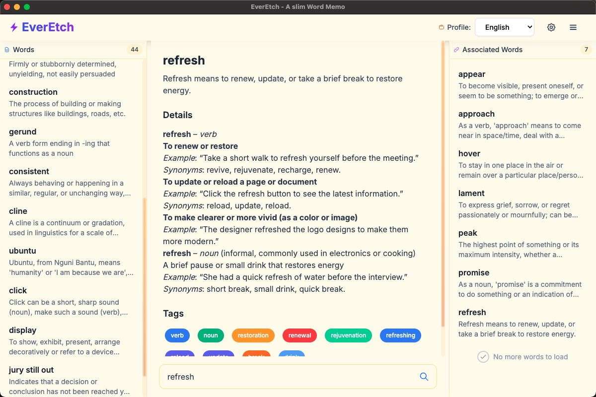

# EverEtch - Word Memo Application

A slim, modern word memo application built with Electron, TypeScript, and SQLite.



## Features

- **Multi-profile support**: Create separate profiles for different languages or study sessions
- **AI-powered word generation**: Generate meanings, tags, and summaries using OpenAI
- **Tag-based organization**: Organize words with custom tags and colors
- **Responsive design**: Clean, modern UI with resizable panels
- **Cross-platform**: Works on Windows, macOS, and Linux

## Data Storage

EverEtch stores user data in the appropriate system user data directory under a `data` subdirectory:

- **Windows**: `%APPDATA%/EverEtch/data/`
- **macOS**: `~/Library/Application Support/EverEtch/data/`
- **Linux**: `~/.config/EverEtch/data/`

This ensures user data is properly separated from the application code and follows platform conventions.

### Data Migration

If you're upgrading from a version that stored data in the project directory, run the migration script:

```bash
npm run migrate-data
```

This will safely move your existing data files (`profiles.json`, `English.db`, `Japanese.db`, etc.) to the user data directory.

## Development

### Prerequisites

- Node.js 18+
- npm

### Installation

```bash
npm install
```

### Development

```bash
# Build and run in development mode
npm run dev

# Or run separately:
npm run build-css  # Build CSS
npm run build      # Build TypeScript
npm start          # Start Electron app
```

### Building

```bash
npm run build
```

## Project Structure

```
src/
├── main.ts              # Electron main process
├── preload.ts           # Preload script for IPC
├── utils.ts             # Utility functions for paths and IDs
├── ai/
│   └── AIModelClient.ts # OpenAI integration
├── database/
│   ├── DatabaseManager.ts   # SQLite database operations
│   └── ProfileManager.ts    # Profile management
└── renderer/
    ├── index.html       # Main UI
    ├── renderer.ts      # Renderer process logic
    └── styles.css       # Styles
```

## Usage

1. **Profiles**: Switch between different language profiles using the dropdown
2. **Adding Words**: Enter a word and click "Generate" to get AI-powered meanings and tags
3. **Organizing**: Use tags to categorize and find related words
4. **Settings**: Configure AI models and API keys in the settings modal

## Configuration

Configure your AI provider in the Settings modal:

- **OpenAI**: Requires API key
- **Google**: Requires API key

## License

MIT
