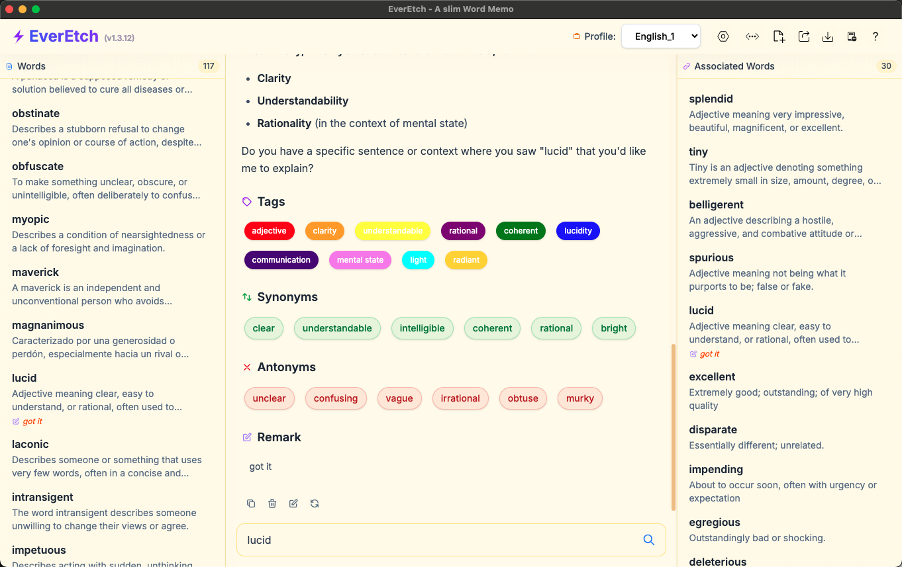

# EverEtch - Smart Word Memo

A slim, AI-powered app to help you learn and remember words.




## ✨ WTF

- Why the hell in this AI epoch, we still need ads dict apps ???
- Why the hell we still need dict license ???
- Why the hell we still need to pay for a dict app ???

**EverEtch is here:**

- No fxxking ads, no tracking.
- Completely free of charge.
- Fuck Youdao dict!
- Fuck Baicizhan!
- Fuck Ads!
- Fuck Subscription Fees!

Just enter any word and get instant meanings, examples, and related words all powered by AI.


## 🚀 Quick Start

1. **Download and Install**: Get EverEtch from the releases page
2. **Create a Profile**: Set up your first word collection
3. **Add Your First Word**: Type a word and click "Generate" to let AI help

## 📱 How to Use

### Adding Words
- Type any word you want to learn
- Click "Generate" to get AI-powered explanations
- The app will suggest tags, synonyms, and antonyms automatically
- Find words instantly by typing any part of the word
- Click on tags or related words to discover more

### Importing Words
- Click the "Import Words" button in the header
- Select a text file (.txt, .md, or .csv) containing words
- Each word should be on a separate line
- The app will automatically import all words and generate their meanings
- View import progress and results in real-time

## ⚙️ Settings

### AI Configuration
Set up your AI helper in the settings:
- **OpenAI**: Add your API key for GPT models
- **Google**: Add your API key for Gemini models
- **Model Management**: Save and switch between different AI model configurations instantly

### Profiles
- Create separate collections for different languages
- Switch between profiles instantly
- Keep your learning organized

## 💾 Data Storage

Your word collections are saved locally on your computer:
- **Windows**: In your AppData folder
- **Mac**: In Application Support
- **Linux**: In your config directory

Your data stays private and secure on your device.
**No fxxking storage fees!**

## ☁️ Google Drive Sync

Backup and sync your word collections across devices:

### Cloud Backup
- **Upload Profiles**: Save your word collections to Google Drive
- **Automatic Timestamps**: Files are named with upload date/time
- **Cross-Device Sync**: Access your words on any computer

### Easy Import/Export
- **One-Click Upload**: Export Profile → Upload to Google Drive
- **Simple Download**: Import Profile → Import from Google Drive
- **File Management**: View, delete, and organize your backups


### Getting Started
1. Click the menu (⋯) in the app header
2. Choose "Export Profile" → "Upload to Google Drive"
3. Authenticate with Google (one-time setup)
4. Your profile uploads automatically

**Free cloud storage with your Google account!**

## 🛠️ For Developers

### Requirements
- Node.js 18 or newer
- npm (comes with Node.js)

### Run the App
```bash
npm run dev
```

### Build for Distribution
```bash
npm run build
```

## 📂 Project Files

```
src/
├── main.ts              # App startup and windows
├── renderer.ts          # User interface logic
├── database/            # Word storage and search
├── ai/                  # AI word generation
└── utils.ts             # Helper functions
```

## 📋 Recent Updates

- **Faster Search**: Improved word search and relationship finding
- **Better Performance**: Optimized for large word collections
- **Memory Efficient**: Uses less memory when loading many words

## 📄 License

EverEtch is free and open source under GPL v3.

### Important Notes:
- **Free to Use**: For personal learning and education
- **No Commercial Use**: Not for business or selling
- **No Ads**: Completely ad-free
- **Open Source**: You can view and modify the code

See [LICENSE](LICENSE) for full details.

---

**Made for language learners, students, and anyone who loves words!** 📚
